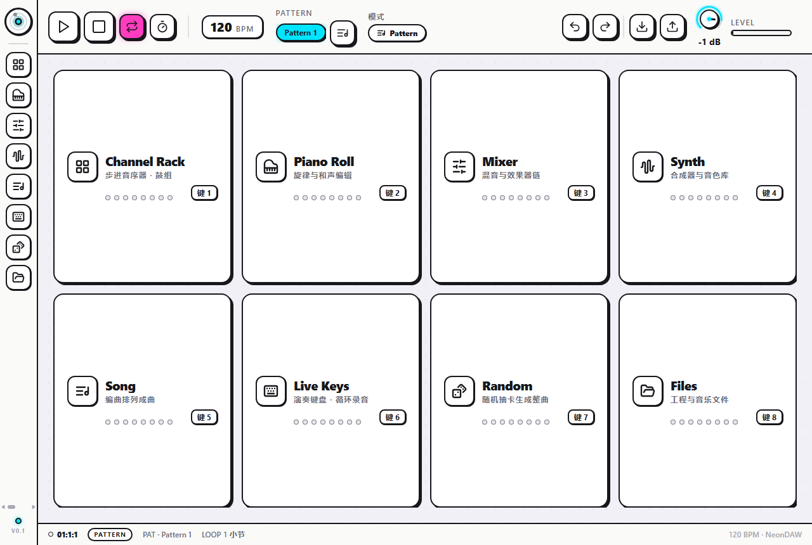
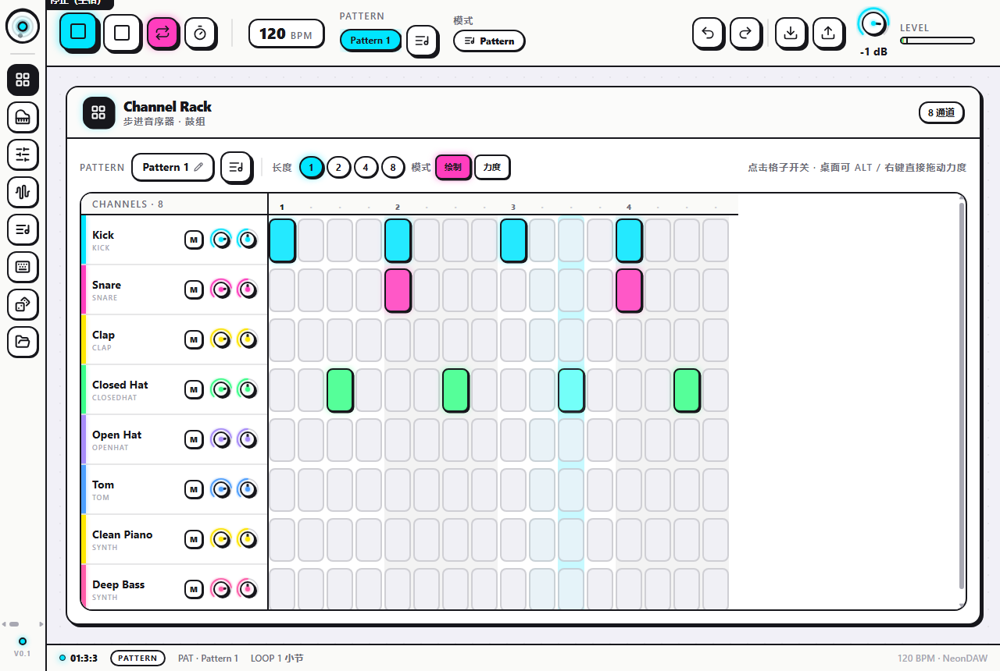

# NeonDAW

[English](README.md) · **简体中文**

**一个完全跑在浏览器里的完整 DAW。**
排鼓、写旋律、挂效果器混音、把 Pattern 排列成整曲，最后导出真实 WAV。免安装、无账户、无后端：鼓与合成器用 Web Audio 实时发声，旋律性乐器用打包的真实采样，全部在浏览器端完成。

> 🎧 **在线体验：** _<https://xanthanl.github.io/neon-daw/>_ —— 开启 Pages（Settings → Pages → Source 选 **GitHub Actions**）后填入；仓库已内置部署工作流。



| | | |
|---|---|---|
| **8 大模块** | Channel Rack · Piano Roll · Mixer · Synth · Song · Live Keys · Random · Files |
| **声音** | 6 件合成 808 鼓 · 16 个合成器预设 · 14 种插入效果器 · 钢琴 / keys / bass / pad 用打包真实采样 |
| **生成** | 20 种命名风格 · 每曲 3–8 个 Pattern · 和声 / 动机 / 曲式引擎 |
| **界面** | 中英双语 · 桌面 + 移动自适应布局 |
| **导出** | 离线渲染 WAV，带三阶段进度条 |
| **技术栈** | React 18 · TypeScript · Tone.js · Zustand · Framer Motion · Tailwind CSS 4 · Vite |
| **体积** | 100% 客户端 · 单一静态产物 · 可托管到 GitHub Pages |

---

## 为什么做 NeonDAW

大多数"网页合成器" demo 停在一个键盘。NeonDAW 想在单个页面里跑通完整制作闭环：

```
鼓（步进音序）→ 旋律（钢琴卷帘）→ 混音（效果器 + 推子）→ 编曲（Song）→ 导出（WAV）
```

并且把浏览器当成真乐器：首次交互解锁音频、lookahead 调度保证走带精准、离线导出复刻同一套信号链——**听到的即下载到的**。界面支持中 / 英双语，默认英文，顶栏一键切换。

## 功能

### 🥁 Channel Rack
- 16 分步进网格，每步带**力度**（桌面拖动 / 触屏涂抹）。
- Pattern 管理器：新建 / 重命名 / 复制 / 改长度（1–8 小节）/ 清空 / 删除，删除级联清理 Song 片段，全程可撤销。

### 🎹 Piano Roll
- 点击创建、拖动移动、边缘拉伸时值、右键或长按删除。
- 吸附档位（1/4 … 1/32、1/8T）、缩放、力度条按力度给音符上色。

### 🎚 Mixer
- 每轨实时电平表（含峰值保持）、推子、声像、静音/独奏，**4 个效果器插槽**。
- 14 种效果器：混响、延迟、EQ3、滤波、压缩、合唱、移相、失真、比特破碎、颤音、限制、立体声增宽…

### 🎛 Synth
- 双振荡器 + 滤波器 + ADSR（带实时包络曲线）+ 16 预设 / 5 大类。

### 🎼 Song
- 6 条编排轨，按小节放置 / 移动 / 复制 / 删除 clip，整曲播放。
- **点击或拖动标尺 / 播放头即可拖动跳转进度**，播放中与停止时都可用。

### ⌨️ Live Keys
- 25 键触控键盘 + 八度移调，支持**循环叠录**：Pattern 循环时弹奏，就近量化写进当前循环。
- 桌面端可直接用**物理键盘**弹奏（`a s d f g h j k` = 白键、`w e t y u` = 黑键）；按住/松开干净释放（指针捕获 + 窗口失焦释放）。

### 🎲 Random
- 一键抽一种命名风格，生成调式、和声、动机、鼓组、曲式自洽的整曲，并自动切到 Song 试听。可选 **3–8 个 Pattern**：数越多，编曲越长、声部越多（lead / pad / arp 逐级加入）、groove 越密。

### 📁 Files
- 工程 JSON 导入 / 导出、新建空白工程，以及**导出 WAV**（当前 Pattern ×1/×2/×4 或整曲），带三阶段进度条且渲染期间页面保持响应。



## 架构速览

三个 Zustand store（`project` 持久化到 localStorage、`ui`、`history` 50 步快照撤销）驱动一个持有 Tone.js 走带与逐通道 / 逐轨节点图的 `AudioEngine`；离线导出复刻同一套建链规则，保证试听与导出一致。纯 TS 的 `src/utils/music` 引擎支撑"Random"生成，`src/i18n` 收中英文案字典。

```
src/
  audio/        engine · 鼓合成 · 合成预设 · samples(本地打包) · effects · 离线渲染 · wav 编码
  stores/       project（持久化） · ui · history
  components/   8 模块 + 布局 + ui kit
  i18n/         语言状态 + 中英文案字典
  utils/music/  rng · theory · motif · groove · styles · compose
```

## 音色来源

NeonDAW 是混合乐器：鼓为实时合成（808 味，可调音高/衰减）；lead / pluck 用内置双振荡合成器；**钢琴 / keys / bass / pad 用真实采样，已预打包到本地 `public/samples/`**（由 `scripts/fetch-samples.mjs` 一次性抓取，FluidR3_GM，CC-BY 3.0），运行时同源加载、不再实时跨域取 CDN；按 MIDI 号命名，黑键也齐全；取不到时自动回退合成器——永不静音。

## 许可

MIT © NeonDAW contributors。

乐器采样为 **FluidR3_GM**，© Frank Neff，经
[`gleitz/midi-js-soundfonts`](https://github.com/gleitz/midi-js-soundfonts) 以
**CC-BY 3.0** 分发。
